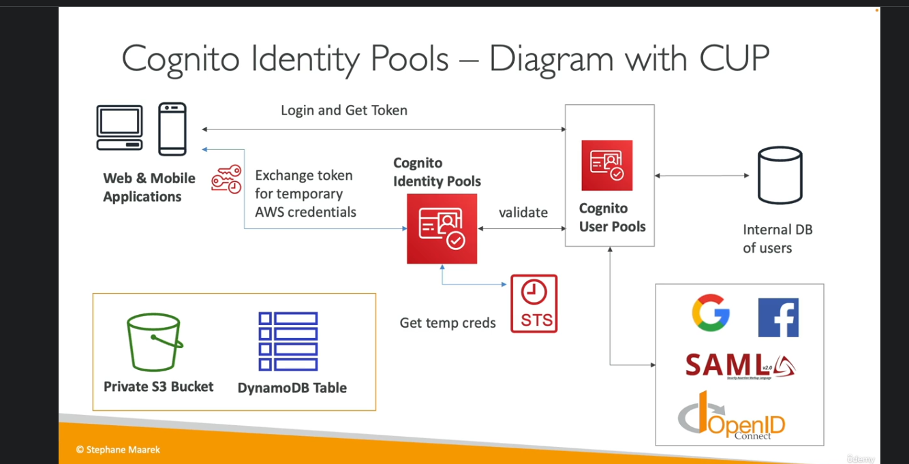

# Cognito

Give a user an identity to a mobile or web application.

Cognito User Pools:

* sign-in functionality for app users
* integrates with api gateway and ALBs

Cognito Identity Pools (Federated Identity):

* Provide AWS creds to users so they can access aws resources directly
* Integrate with Cognito User Pools as an identity provider

Cognito vs IAM:

* cognito is for web/mobile users outside of AWS
* cognito use cases identified by phrases "hundreds of users", "mobile users" and "saml"

### Cognito Sync

Synchronize data for mobile/app users without implementing your own backend.

### Cognito User Pools (CUP)

Serverless db for web/mobile app users.

* simple login (username/email) and pw
* password reset
* email and phone verification
* MFA
* Federated identities: login with Facebook, Google, or saml
* Block users if creds compromised elsewhere
* Login sends back a JWT

Note that federated identity uses 'identity providers' which is just like dependency injection.

Users can be managed (deleted, grouped, etc) via the console.

Default hosted UI can be customized:

* URL
* logo
* CSS

### Integrations: API Gateway and ALB

API GW:

* Users login through Cognito User Pools to retrieve token
* Users then pass the token to Rest APIs fronted by API GW
* API GW authenticates their token, then allows them to access backend

ALB:

* Users hit ALB which authenticates them to Cognite User Pools
* Once authenticated, they can be routed via Listeners and Rules to backend Target Groups

### Hands-On

1) Choose provider type: Cognito User Pool, Federated Provider (or both)
2) login cred: username, phone, or email
3) set pw policy
4) configure MFA (optional)
5) configure user-account recovery options
6) select to use host authentication page or not
7) integrate an application (you can only test app login via a hosted app)
8) set hosted UI callback URL, to which users are redirected on login

Configure Lambda triggers: trigger lambdas based on user events (creation, auth, update, etc), allowing you to integrate with any other service you want: validation, messaging (SMS), etc.

### Lambda Triggers

Trigger arbitrary lambdas based on various events:

* authentication: pre-auth, post-auth, pre-token
* sign-up: pre-signup, post-confirmation, migrate user
* message: custom message trigger (customization or localization of messages)
* token creation: pre-token generation to add/remove attributes of tokens

### Custom Domains

For custom domains you must create an ACM in us-east-1 (no other option).
The custom domain must be defined in the "app integration" section.

### Adaptive Authentication

Block signins or require MFW if the login appears suspicious based on configurable criteria:

* high/medium/low triggers on login
* users are promoted for a second MFA only when triggered
* risk score: location, ip address, etc.
* checks for compromised creds
* integrated with CloudWatch for failed challenges, logins, etc

### Decoding an ID Token: JWT

CUP issues JWT tokens in b64:

* {header}.{claims}.{signature}
* signature is verified using libraries to get user info, sub UUID, email, etc
  * from sub UUID you can retrieve all user info

### ALB

ALB can securely authenticate users, offloading user auth logic and allowing your apps to focus on business logic

Authenticate users through: Identity Provider (IdP) (OIDC) or Cognito User Pools.
    *Social IdPs, such as amazon, Facebook, or Google
    * Corporate identities using SAML, LDAP, or MS AD

Must use an https listener to set authenticate-oidc and authenticate-cognito rules.
OnAuthenticatedRequest: an event that you can configure to authenticate (default), deny, or allow.

OIDC integration: ALB redirects to IdP, whose token is then passed to ALB as auth-grant token, which produces an id-token and access token, and finally a bunch of user claims and further transactions :(.

### Cognito Identity Pools (Federated Pools)

Get identities for 'users' so they obtain temporary aws credentials to access aws services (s3 bucket, dynamodb table, etc). These are like a proxy for pools of users to access aws services, but with a different lifecycle. It acts as a proxy to STS, which produces the temporary user credentials.

* usecase: we cannot create IAM roles for them because there are too many users, and we do not trust them.

Your identity pool can include:

* public providers (login with amazon, fb, Google)
* users in an amazon cognito pool
* opeid & saml
* developer authenticated ids

Cognito Identity Pools also allow for unauthenticated guest user policy access: guest users can access certain things with aws credentials.

Users can then access AWS services directly or through API Gateway:

* IAM policies applied to the credentials are defined in Cognito
* they can be customized based on the user_id for finer control

IAM Roles:

* we can define a default IAM role for authenticated and guest users
* define rules to choose roles for each user based on user_id
* you can partition users access using policy variables
* IAM creds are obtained by Cognito Identity Pools through STS
* the roles must have a trust policy of Cognito Identity Pools

1) Create a guest user with a specific IAM policy, ie Allow ListBucket based on Condition where s3:prefix resembles cognito-identity.

In this manner, give user to access only what resembles their user-id.
In DynamoDB, we can use the same concept to implement row-level security and partitioning.

### Cognito User Pools vs Identity Pools

User Pools: for authentication.

* db of user for your web and mobile apps
* allows to federate logins through public social apis, OIDC, or SAML (corporate)
* can customize hosted auth UI
* has triggers with Lambda
* adapt the signin to different risk levels

Identity Pools: for authorization.

* obtain AWS creds for your users
* users can login through public social, OIDC, SAML or User Pools
* integrates with CUP
* users can be unauthenticated
* key: users are mapped to IAM roles and policies

Study this diagram well: CUP first **authenticates** users, providing them a token then passed to CIP. CIP then calls STS to generate **authorization** claims; CIP also allows unauthenticated/guest access.
