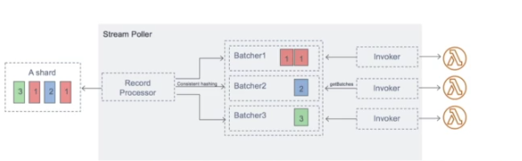

# Lambda

The benefits of serverless with Lambda:

* easy pricing, pay per request and compute time
  * pay per calls: first 1M requests are free, $0.2 per 1M requests thereafter
  * pay per duration: 400,000GB-seconds of compute time per month is free
    * this means 400,000 seconds if function uses 1GB of RAM; 3.2M seconds if it uses 128MB of RAM (it scales proportionally)
    * after that, $1 per 600k of GB-seconds
    * GB-seconds: refers to how much RAM is allocated to the function, per second used
* integrated with many AWS services
  * Kinesis, S3, DynamoDB, CloudFront, CloudWatch Events bridge, SNS/SQS, Cognito, API GW, StepFunctions
* monitoring through CloudWatch
* easily acquire more resources per function, up to 10GB RAM

Language support:

* Java, Golang, Node.js, Python, C#, Ruby, Custom Runtime API (e.g. Rust)
* Lambda container image
  * The container image must implement the Lambda Runtime API
  * ECS/Fargate is preferrable for running arbitrary docker images

### Synchronous Invocations

Def: awaiting for the lambda results client side. Think of this as the API GW pattern,
whereby a client queries an API which then proxies the request to another service, but does not return until
the backend query completes.

* error handling must happen right away
* CLI, SDK, and API GW all work this way

User-invoked synchronous invocations:

* ELB (ALB), API GW, CloudFront (Lambda@Edge), S3 Batch

Service invoked:

* Cognito, StepFunctions, Lex, Alexa, Kinesis Data Firehose

Example cli call:

* `aws lambda invoke --function-name hello-world --cli-binary-format raw-in-base64-out --payload '{"key1": "value1"}' response.json`

### ALB Integration: Expose a Lambda via an HTTPS Endpoint

Proxy lambda calls via ALB or API GW.
The lambda must be registered in a target group.
Requires a resource-based policy to allow the ALB to invoke the function (this is configured automatically if developed via the console).

ALB to Lambda query info:

* http data is converted to json
* lambda can access request headers, HTTP method, query string params, headers, and body, and isBase64Encoded flag

The lambda response does likewise, returning json-encoded HTTP to the ALB.

Multi-header values: an ALB setting that can be enabled to allow passing http query string parameters as array-structured data to the lambda:

* "<http://example.com/path?foo=123&foo=789>"
* is converted to: `"queryStringParameters": {"foo": ["123", "789"]}`
  * for both the lambda event and response objects

### Asynchronous Invocations

Supported for S3, SNS, CloudWatch Events, CodePipeline, CodeCommit, and more,
allowing you to speed up processing if you don't need to await results (e.g. process 1,000 files). Event-based processing.

Asynchronous invocations support error-based retries, 3 retries total.
Events are placed in an event queue in the lambda service; the lambda is invoked up to 3 times, with a +1m wait after each failure.
You can configure a DLQ (SNS or SQS) for failed processing items.

CLI execution example:

* `aws lambda invoke --function-name foobar --cli-binary-format raw-in-base64-out --payload '{"key1": "value1"}' --invocation-type Event  --region us-west-1 response.json`

### CloudWatch Events / EventBridge

Trigger lambdas based on:

* time/schedule: cron or rate logic with EventBridge rules
* state/event-patterns: CodePipeline EventBridge rules to trigger based on state-changes of services

Configuration requires a resource-based policy allowing the event to invoke the lambda (via its ARN).

### S3 Integrations

Many S3 event integration patterns are available:

Events on:

* ObjectCreated, ObjectRemoved, ObjectRestore, Replication
* Object name filtering is possible
* Use-case: generate thumbnails of images uploaded to S3
* Event notifications can take up to minutes, but usually occur in seconds

The object metadata is sent to the lambda function.

### Lambda Event Source Mapping

The usecase of event-source mapping is where records need to be polled from some source; your lambda is invoked synchronously.
Applies to Kinesis Data Streams, SQS and SQS-FIFO, DynamoDB streams.

* event source mapping lives within the lambda service

Streams: Kinesis and DynamoDB integration

* an event-source mapping creates an iterator for each shard, processes items in order
* processed items are not removed from stream, they can still be read by other consumers
* process items using a batch window; you can process multiple batches in parallel
  * up to 10 batches per shard; in-order processing still guaranteed per partition key

Error handling:

* by default, the entire batch is reprocessed until the lambda succeeds, or the items in the batch expire
* to ensure in-order processing, the affect shard is paused until the error resolves
* configuration: discard old events, restrict the number of retries, or split the batch on error
* discarded events can go to a destination

SQS and SQS-FIFO Integration: event-source mapping will poll SQS using long-polling.

* specify a batch size of 1-10 items, and a batch time window
* recommended to set visibility timeout to 6x the timeout of the lambda func
* To use a DLQ:
  * set up on the SQS queue, not the lambda
  * or use a Lambda destination for failures
* requires a policy to allow the lambda to access SQS queue, '*executionrole'

Queues and Lambda:

* lambda also support in-order processing for FIFOs, scaling up to the number of active message groups
* For standard queues, items are necessaily processed in order
* Lambda scales up to process a standard queue as quickly as possible
* When an error occurs, batches are return to the queue as individual items and might be processed in a different grouping than the original batch
* the event source mapping may receive the same item from the queue twice, even if no function error occurred
* lambda deletes items from the queue after they're processed successfully
* can configure source queue to send item to a DLQ

Event-mapper scaling: scaling depends on the service.

1) Kinesis Data Streams and DynamDB streams:
    * one lambda invocation per stream shard
    * parallelization allows up to 10 batches processed per shard simultaneously
2) SQS Standard:
    * lambda adds 60 more instance per minute to scale up
    * up to 1000 batchs of messages processed simultaneously
3) SQS FIFO:
    * Messages with the same GroupID will be processed in order
    * The lambda function scales to the number of active message groups

### Event and Content Objects

Parameters of lambda functions (both are json objects):

* Event: the request itself and its metadata, invoking service, event source and region
* Context: metadata around the function (memory limit, function name, log stream, invoked arn, etc.), methods/properties that provide information about the invocation and runtime env.

### Lambda Destinations

Send the result of an asynchronous invocation or an event-mapper to a destination.

* async invocations: send both *successful* or *failed* events to a dest (SQS, SNS, etc)
  * AWS' recommendation is to use Destinations instead of a DLQ, or both
* event source mapping: *discarded* event batches can be sent to SQS or SNS

Successful invocations forward to a dest will contain both request and response; failed invocations forward to a dest will have only the failed request and failure info.

### Lambda Permissions and IAM

IAM Role grants the lambda function permissions to AWS services and resources.
Example managed policies for Lambda:

* AWSLambdaBasicExecutionRole: permission to upload logs to CloudWatch
* AWSLambdaKinesisExecutionRole: read from Kinesis
* AWSLambdaDynamoDBExecutionRole: read from dynamo db streams

Note that these lambda roles have the "*ExecutionRole" suffix in order to read or access things.
Best practice: one Lambda execution role per function.

Resource-based policy: use these to give other accounts and services permission to use the lambda, similar to S3 bucket policies.
These usually resemble: "ALLOW, lambda:InvokeFunction, resource=the-function-arn, condition=source-resembles-ELB-arm
An IAM principal can access Lambda:

* if the IAM policy attached to the principal authorizes it
* OR if the resource-based policy authorizes (service access)

When an AWS service like S3 calls your Lambda function, the resource-based policy gives it access.

### Lambda Environment Variables

Key-value pairs in string form.

* adjust function behavior without modifying code
* env vars are available to the code
* lambda adds its own system env vars as well
* helpful to store secrets, which can be encrypted by the lambda service key or your own KMS-CMK

### Lambda Logging and Monitoring

* CloudWatch logs:
  * lambda execution logs are stored
  * must ensure that lambda func has an execution role with an IAM policy allowing it to write to CloudWatch logs
* CloudWatch metrics:
  * invocations, duration, concurrent executions
  * error counts, other failures
  * iterator age (Kinesis)

X-Ray:

* enable in lambda configuration (Active Tracing)
* runs the X-Ray daemon for you
* use the X-Ray sdk in lambda code
* must ensure that the lambda ufnc has the IAM Execution Role to write: AWSXRayDaemonWriteAccess
* Env vars:
  * _X_AMZN_TRACE_ID: contains the tracing header
  * AWS_XRAY_CONTEXT_MISSING: by default, LOG_ERROR
  * AWS_XRAY_DAEMON_ADDRESS: ip:port for api usage
  